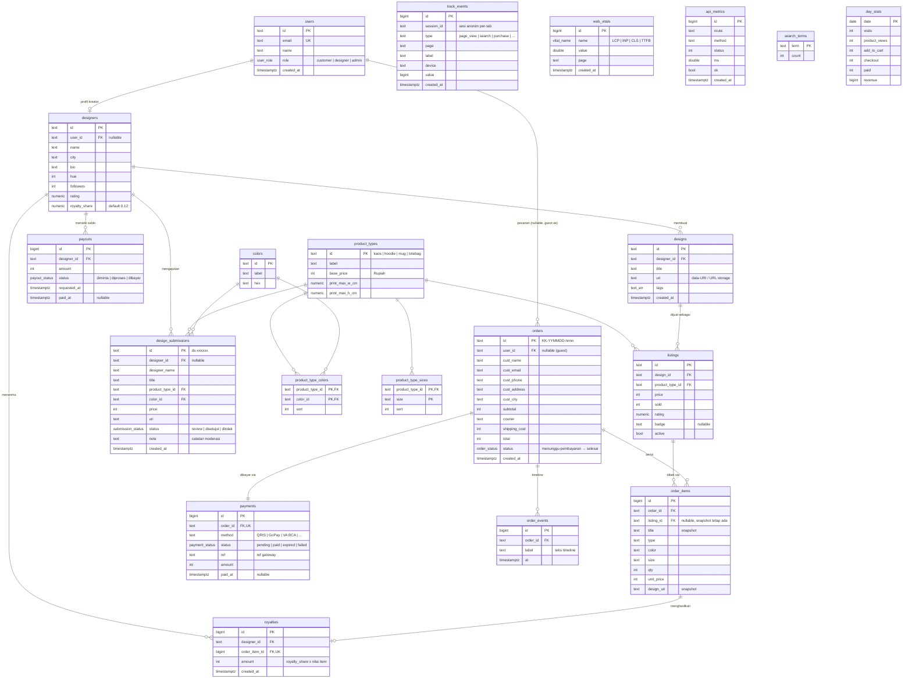

# KaryaKita — Skema Database (PostgreSQL)

Database: **PostgreSQL 16** · skema penuh di [`internal/db/schema.sql`](internal/db/schema.sql)
(dimigrasikan otomatis saat API pertama kali start, dicatat di `schema_migrations`).

20 tabel dalam 5 kelompok:

| Kelompok | Tabel |
|---|---|
| **Identitas** | `users`, `designers` |
| **Katalog** | `product_types`, `colors`, `product_type_colors`, `product_type_sizes`, `designs`, `listings` |
| **Transaksi** | `orders`, `order_items`, `payments`, `order_events` |
| **Kreator** | `design_submissions`, `royalties`, `payouts` |
| **Analitik** | `track_events`, `web_vitals`, `api_metrics`, `search_terms`, `day_stats` |

## Diagram ERD



> Tabel analitik (`track_events`, `web_vitals`, `api_metrics`, `search_terms`, `day_stats`)
> sengaja **tanpa foreign key** ke tabel transaksi — append-only, anonim, dan bisa dipindah ke
> warehouse terpisah tanpa memutus relasi.

## Keputusan desain

- **Uang = integer Rupiah.** Tidak ada pecahan sen di IDR; menghindari error floating point.
- **Snapshot di `order_items`.** Judul, harga, dan gambar desain disalin saat checkout, jadi
  pesanan lama tetap benar walau listing diubah/dihapus (`listing_id` nullable `ON DELETE` aman).
- **`payments` terpisah dari `orders`.** Siap untuk retry pembayaran/metode ganda, dan meniru
  webhook gateway: `PATCH {action:"pay"}` = notifikasi Midtrans/Xendit. Idempoten — bayar dua
  kali tidak menggandakan royalti (`ON CONFLICT (order_item_id) DO NOTHING`).
- **Royalti dibukukan saat pembayaran**, dihitung dari `designers.royalty_share` (default 12%),
  satu baris per `order_item` — auditable, tinggal `SUM` untuk saldo kreator.
- **Guest checkout.** `orders.user_id` nullable; saat auth ditambahkan, kolom sudah siap.
- **Enum PostgreSQL** untuk semua status — nilai tak valid ditolak di level database.
- **`day_stats`** = agregat harian (di-seed untuk demo, di produksi diisi job harian dari
  `track_events`); statistik hari berjalan digabung live dari `track_events` di `GET /api/stats`.

## Cara pakai

```bash
docker compose up -d          # Postgres 16 di :5432 (user/db: karyakita)
go run ./cmd/api              # migrasi + seed otomatis, API di :8081
```

Reset total: `docker compose down -v` lalu jalankan ulang API.

Koneksi manual: `docker exec -it karyakita-db psql -U karyakita -d karyakita`
