# KaryaKita — Skema Database (PostgreSQL)

Database: **PostgreSQL 16** · skema penuh di [`internal/db/schema.sql`](internal/db/schema.sql)
(dimigrasikan otomatis saat API pertama kali start, dicatat di `schema_migrations`).

27 tabel dalam 5 kelompok:

| Kelompok | Tabel |
|---|---|
| **Identitas** | `users` (profil + preferensi + kredensial), `sessions` (sesi login), `auth_tokens` (link verifikasi & reset password), `designers`, `user_designs` (desain custom pribadi — tanpa royalti) |
| **Katalog** | `product_types`, `colors`, `product_type_colors`, `product_type_sizes`, `designs`, `listings`, `categories`, `design_categories` |
| **Transaksi** | `orders`, `order_items`, `payments`, `order_events`, `reviews` (ulasan terverifikasi + moderasi), `vouchers` |
| **Kreator** | `design_submissions` (terbit jadi listing saat disetujui), `royalties`, `payouts` |
| **Analitik** | `track_events`, `web_vitals`, `api_metrics`, `search_terms`, `day_stats` |

## Diagram ERD

```mermaid
erDiagram
    users ||--o| designers : "profil kreator"
    users ||--o{ orders : "pesanan (nullable, guest ok)"
    users ||--o{ user_designs : "desain custom pribadi"
    users ||--o{ sessions : "sesi login"
    users ||--o{ auth_tokens : "link email"
    product_types ||--o{ user_designs : ""
    colors ||--o{ user_designs : ""

    designers ||--o{ designs : "membuat"
    designers ||--o{ design_submissions : "mengajukan"
    designers ||--o{ royalties : "menerima"
    designers ||--o{ payouts : "menarik saldo"

    product_types ||--o{ product_type_colors : ""
    colors ||--o{ product_type_colors : ""
    product_types ||--o{ product_type_sizes : ""
    product_types ||--o{ listings : ""
    product_types ||--o{ design_submissions : ""
    colors ||--o{ design_submissions : ""

    designs ||--o{ listings : "dijual sebagai"
    listings ||--o{ order_items : "dibeli via"
    categories ||--o{ design_categories : ""
    designs ||--o{ design_categories : ""
    listings ||--o{ reviews : "dinilai"
    orders ||--o{ reviews : "bukti pembelian"
    listings ||--o| design_submissions : "diterbitkan dari"

    orders ||--o{ order_items : "berisi"
    vouchers ||--o{ orders : "dipakai di"
    orders ||--|| payments : "dibayar via"
    orders ||--o{ order_events : "timeline"
    order_items ||--o| royalties : "menghasilkan"

    users {
        text id PK
        text username UK "unik tanpa beda huruf besar/kecil"
        text email UK
        text name
        user_role role "customer | designer | admin"
        text password_hash "bcrypt; NULL = akun Google saja"
        text google_sub UK "nullable"
        bool email_verified
        timestamptz last_login_at "nullable"
        timestamptz created_at
    }
    auth_tokens {
        text id PK "sha256(token)"
        text user_id FK
        auth_token_purpose purpose "verify_email | reset_password"
        timestamptz expires_at "24 jam / 30 menit"
        timestamptz used_at "NULL = belum dipakai"
    }
    sessions {
        text id PK "sha256(token) — token mentah hanya di cookie"
        text user_id FK
        timestamptz expires_at "30 hari"
        timestamptz last_seen_at
        text user_agent
        text ip
    }
    designers {
        text id PK
        text user_id FK "nullable"
        text name
        text city
        text bio
        int hue
        int followers
        numeric rating
        numeric royalty_share "default 0.12"
    }
    product_types {
        text id PK "kaos | hoodie | mug | totebag"
        text label
        int base_price "Rupiah"
        numeric print_max_w_cm
        numeric print_max_h_cm
    }
    colors {
        text id PK
        text label
        text hex
    }
    product_type_colors {
        text product_type_id PK,FK
        text color_id PK,FK
        int sort
    }
    product_type_sizes {
        text product_type_id PK,FK
        text size PK
        int sort
    }
    designs {
        text id PK
        text designer_id FK
        text title
        text uri "data-URI / URL storage"
        text_arr tags
        timestamptz created_at
    }
    listings {
        text id PK
        text design_id FK
        text product_type_id FK
        int price
        int sold
        numeric rating
        text badge "nullable"
        bool active
    }
    orders {
        text id PK "KK-YYMMDD-nnnn"
        text user_id FK "nullable (guest)"
        text cust_name
        text cust_email
        text cust_phone
        text cust_address
        text cust_city
        int subtotal
        text courier
        int shipping_cost
        int discount "potongan voucher"
        text voucher_code FK "nullable"
        text cust_postal
        text notes "catatan untuk kurir"
        text shipped_courier "nullable — kurir yang mengirim"
        text tracking_number "nullable — resi, unik per kurir"
        timestamptz shipped_at "nullable"
        timestamptz delivered_at "nullable — laporan kurir paket tiba"
        timestamptz completed_at "nullable — dikonfirmasi pembeli / otomatis"
        int total
        order_status status "menunggu-pembayaran → dibayar → produksi → dikirim → tiba → selesai"
        timestamptz created_at
    }
    order_items {
        bigint id PK
        text order_id FK
        text listing_id FK "nullable, snapshot tetap ada"
        text title "snapshot"
        text type
        text color
        text size
        int qty
        int unit_price
        text design_uri "snapshot"
    }
    payments {
        bigint id PK
        text order_id FK,UK
        text method "QRIS | GoPay | VA BCA | ..."
        payment_status status "pending | paid | expired | failed"
        text ref "ref gateway"
        int amount
        timestamptz paid_at "nullable"
    }
    vouchers {
        text code PK "huruf besar"
        voucher_kind kind "percent | fixed | shipping"
        int value
        int min_subtotal
        int max_discount "nullable"
        timestamptz ends_at "nullable"
        int usage_limit "nullable"
        int per_user_limit
        bool active
    }
    order_events {
        bigint id PK
        text order_id FK
        text label "teks timeline"
        timestamptz at
    }
    design_submissions {
        text id PK "ds-xxxxxx"
        text designer_id FK "nullable"
        text designer_name
        text title
        text product_type_id FK
        text color_id FK
        int price
        text uri
        submission_status status "review | disetujui | ditolak"
        text note "catatan moderasi"
        timestamptz created_at
    }
    royalties {
        bigint id PK
        text designer_id FK
        bigint order_item_id FK,UK
        int amount "royalty_share x nilai item"
        timestamptz created_at
    }
    payouts {
        bigint id PK
        text designer_id FK
        int amount
        payout_status status "diminta | diproses | dibayar"
        timestamptz requested_at
        timestamptz paid_at "nullable"
    }
    categories {
        text id PK "alam | anime | batik | ..."
        text label
        text emoji
        int sort
    }
    design_categories {
        text design_id PK,FK
        text category_id PK,FK
    }
    reviews {
        bigint id PK
        text listing_id FK
        text order_id FK "bukti pembelian; unik per pasangan"
        text author
        int rating "1-5"
        text comment
        review_status status "review | disetujui | ditolak"
        text note "catatan moderasi"
    }
    user_designs {
        bigint id PK
        text user_id FK
        text title
        text product_type_id FK
        text color_id FK
        text uri "/uploads/... atau data-URI"
        numeric width_cm
        numeric offset_y_cm
    }
    track_events {
        bigint id PK
        text session_id "sesi anonim per-tab"
        text type "page_view | search | purchase | ..."
        text page
        text label
        text device
        bigint value
        timestamptz created_at
    }
    web_vitals {
        bigint id PK
        vital_name name "LCP | INP | CLS | TTFB"
        double value
        text page
        timestamptz created_at
    }
    api_metrics {
        bigint id PK
        text route
        text method
        int status
        double ms
        bool ok
        timestamptz created_at
    }
    search_terms {
        text term PK
        int count
    }
    day_stats {
        date date PK
        int visits
        int product_views
        int add_to_cart
        int checkout
        int paid
        bigint revenue
    }
```



> Tabel analitik (`track_events`, `web_vitals`, `api_metrics`, `search_terms`, `day_stats`)
> sengaja **tanpa foreign key** ke tabel transaksi — append-only, anonim, dan bisa dipindah ke
> warehouse terpisah tanpa memutus relasi.

## Keputusan desain

- **Uang = integer Rupiah.** Tidak ada pecahan sen di IDR; menghindari error floating point.
- **Snapshot di `order_items`.** Judul, harga, dan gambar desain disalin saat checkout, jadi
  pesanan lama tetap benar walau listing diubah/dihapus (`listing_id` nullable `ON DELETE` aman).
- **`payments` terpisah dari `orders`.** Siap untuk retry pembayaran/metode ganda, dan meniru
  webhook gateway: `PATCH {action:"pay"}` = notifikasi Midtrans/Xendit. Idempoten — bayar dua
  kali tidak menggandakan royalti (`ON CONFLICT (order_item_id) DO NOTHING`).
- **Royalti dibukukan saat pembayaran**, dihitung dari `designers.royalty_share` (default 12%),
  satu baris per `order_item` — auditable, tinggal `SUM` untuk saldo kreator.
- **Checkout wajib login.** Pesanan baru selalu punya `user_id` dan hanya bisa dilihat pemilik/admin;
  `user_id` tetap nullable untuk pesanan guest lama.
- **Harga dihitung server.** `order_items.unit_price`, ongkir, dan `discount` berasal dari database
  saat checkout, bukan dari browser. `total = subtotal + shipping_cost − discount`.
- **Selesai hanya oleh pembeli.** `tiba` (wajib `delivered_at`, CHECK `orders_delivered_has_time`)
  → `selesai` lewat konfirmasi pembeli atau otomatis 48 jam setelah tiba (`completed_at`).
- **Resi wajib sebelum dikirim.** CHECK `orders_shipped_has_tracking`: status `dikirim`/`selesai`
  harus punya `shipped_courier`, `tracking_number`, `shipped_at`. Indeks unik
  `(lower(shipped_courier), tracking_number)` mencegah satu resi dipakai dua pesanan.
- **Voucher** dihitung pemakaiannya dari `orders.voucher_code` (kuota total & per akun), dikunci
  `FOR UPDATE` saat pesanan dibuat agar kuota tidak terlampaui. Diskon ditanggung platform —
  royalti tetap dari harga item.
- **Sesi di database, bukan JWT.** Cookie berisi token acak; tabel `sessions` hanya menyimpan
  hash-nya, jadi kebocoran database tidak membocorkan sesi aktif, dan logout/cabut akses
  berlaku seketika (cukup hapus barisnya).
- **Satu akun, dua cara masuk.** `password_hash` dan `google_sub` sama-sama nullable: akun
  password bisa ditautkan ke Google (email sama), akun Google tidak wajib punya password.
  Keunikan username & email memakai indeks `lower(...)`.
- **Enum PostgreSQL** untuk semua status — nilai tak valid ditolak di level database.
- **`day_stats`** = agregat harian (di-seed untuk demo, di produksi diisi job harian dari
  `track_events`); statistik hari berjalan digabung live dari `track_events` di `GET /api/stats`.
- **Ulasan terverifikasi**: `reviews` unik per `(order_id, listing_id)`, hanya bisa dibuat dari
  pesanan berstatus `selesai`, dan tayang setelah moderasi. Rating listing diperbarui dengan
  smoothing (rating lama berbobot 50 penilaian).
- **Kategori vs tag**: `categories` terkurasi admin (navigasi belanja); `designs.tags` bebas
  diisi kreator ala hashtag (pencarian).
- **Desain custom pribadi** (`user_designs`): dibeli sebagai `order_items` dengan
  `listing_id NULL` → otomatis tak pernah menghasilkan royalti dan tak tampil di katalog.
- **Gambar** disimpan sebagai file (`uploads/` lokal; S3/R2 di produksi) — database hanya
  menyimpan URL.

## Cara pakai

```bash
docker compose up -d          # Postgres 16 di :5432 (user/db: karyakita)
go run ./cmd/api              # migrasi + seed otomatis, API di :8081
```

Reset total: `docker compose down -v` lalu jalankan ulang API.

Koneksi manual: `docker exec -it karyakita-db psql -U karyakita -d karyakita`
